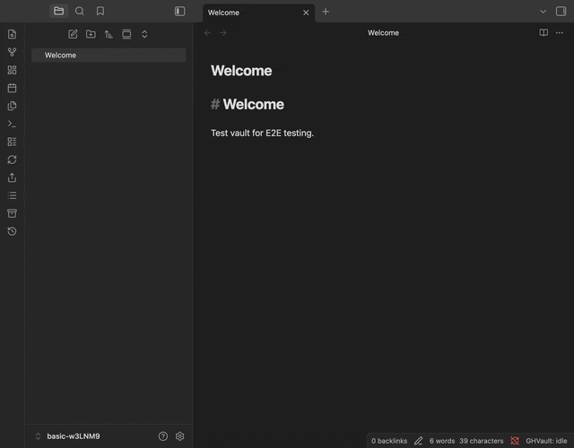

# GHVault

  <strong>Bidirectional vault-GitHub sync for Obsidian</strong> 
  <i>Your vault. Your repo. Always in sync.</i>

  
  
  
  
  
  

---

Syncs your vault to a GitHub repository using the REST and GraphQL APIs directly — no `git` binary, no shell commands, no desktop-only dependencies. Designed from the ground up to work everywhere Obsidian runs, including iOS and Android.

## Why GHVault?

Most Obsidian-to-GitHub solutions wrap the `git` CLI, which means they only work on desktop or require complex mobile workarounds. GHVault takes a different approach:

| | GHVault | git-based plugins |
|---|---|---|
| Mobile (iOS/Android) | Full support | Limited or none |
| Git CLI required | No | Yes |
| Commit signing | Automatic (GPG via GitHub) | Manual setup |
| Setup complexity | Token + repo name | Git install + SSH keys + config |
| Conflict handling | Per-file resolution (skip, local/remote wins, or interactive) | Merge conflicts (manual resolution) |

## Features

| Feature | Description |
|---|---|
| 🔄 **Bidirectional sync** | Push and pull changes between your vault and GitHub in one click |
| ⚡ **Auto-sync** | Detects file changes and syncs automatically with smart debounce and periodic remote checks |
| ⚔️ **Conflict resolution** | Four strategies: skip, local-wins, remote-wins, or interactive diff view with per-hunk accept/reject |
| 📎 **Share as Gist** | Publish any note as a GitHub Gist (public or secret) straight from Obsidian |
| 💾 **Vault Backup** | Full vault snapshots as ZIP archives in GitHub Releases, one-click restore |
| 📜 **File history** | Browse commit history for any file with pagination |
| 🌐 **Publish to GitHub Pages** | Auto-deploy your vault as a website with Quartz, MkDocs, or Astro Starlight ([guide](docs/guide/publishing.md)) |
| 🔒 **Secure by design** | GPG-signed commits, SHA integrity checks, path traversal protection, OWASP audited |
| 📱 **Mobile-first** | Works identically on iOS, Android, and desktop — no git CLI needed |
| 🧩 **Flexible filtering** | Subfolder sync, glob exclude patterns, per-file opt-out via frontmatter |

## Requirements

- Obsidian **1.5.0+** (desktop or mobile)
- A GitHub repository (public or private)
- GitHub Personal Access Token ([fine-grained](https://github.com/settings/tokens?type=beta) recommended)
- Internet connection (no offline sync)

## Quick start

> [!NOTE]
> GHVault is in active development. Test on a non-critical repository first.

1. **Install** — download from [Releases](https://github.com/nyxene/obsidian-ghvault/releases), extract into `.obsidian/plugins/ghvault/`, enable in Settings
2. **Token** — create a [fine-grained PAT](https://github.com/settings/tokens?type=beta) with Contents (read/write) permission for your repo
3. **Configure** — open Settings → GHVault, enter token, owner, repo name, click **Test Connection**
4. **Sync** — click the GHVault ribbon icon or run `GHVault: Sync` from the command palette

For detailed setup instructions, see the [Getting Started](docs/guide/getting-started.md) guide.

## Documentation

- [Getting Started](docs/guide/getting-started.md) — install, connect, first sync
- [Settings Reference](docs/guide/settings.md) — all settings explained
- [How It Works](docs/guide/how-it-works.md) — architecture, sync cycle, limitations, security
- [Workflow Dispatch](docs/guide/workflow-dispatch.md) — trigger GitHub Actions after sync
- [Publishing to GitHub Pages](docs/guide/publishing.md) — build a website from your vault

## Getting help

- [Discussions](https://github.com/nyxene/obsidian-ghvault/discussions) — questions and ideas
- [Issues](https://github.com/nyxene/obsidian-ghvault/issues) — bug reports
- [Contributing](CONTRIBUTING.md) — development setup, code style, how to submit PRs

## Built with AI assistance

This project was developed with the assistance of [Claude Code](https://claude.ai/claude-code) (Anthropic). All architecture decisions, code review, and quality control were performed by the project maintainer. AI was used as a development tool for implementation, testing, and documentation. See our [AI Policy](AI_POLICY.md) for contribution guidelines.

## License

[MIT](LICENSE)
