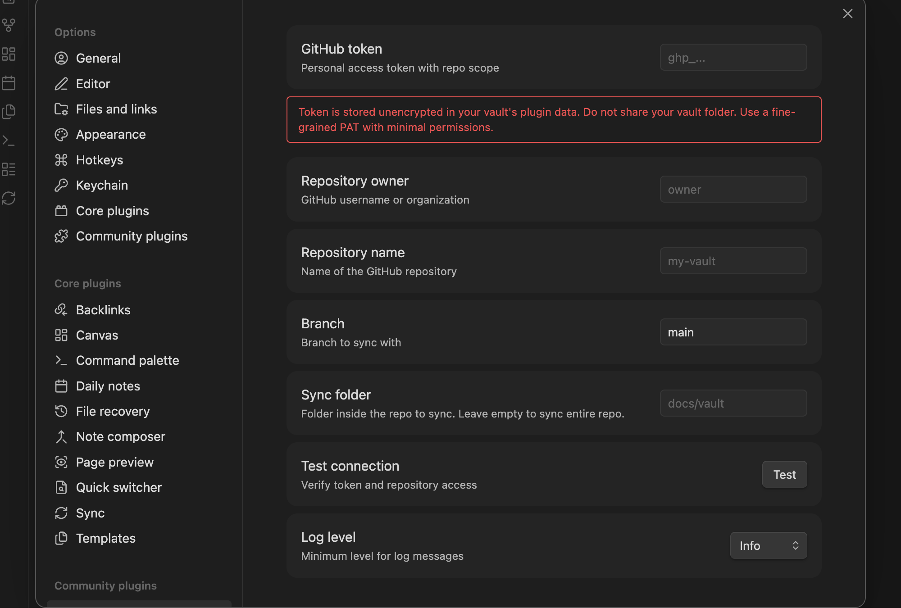
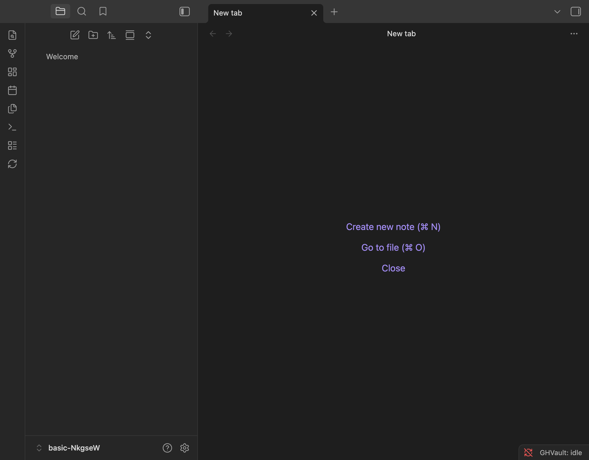
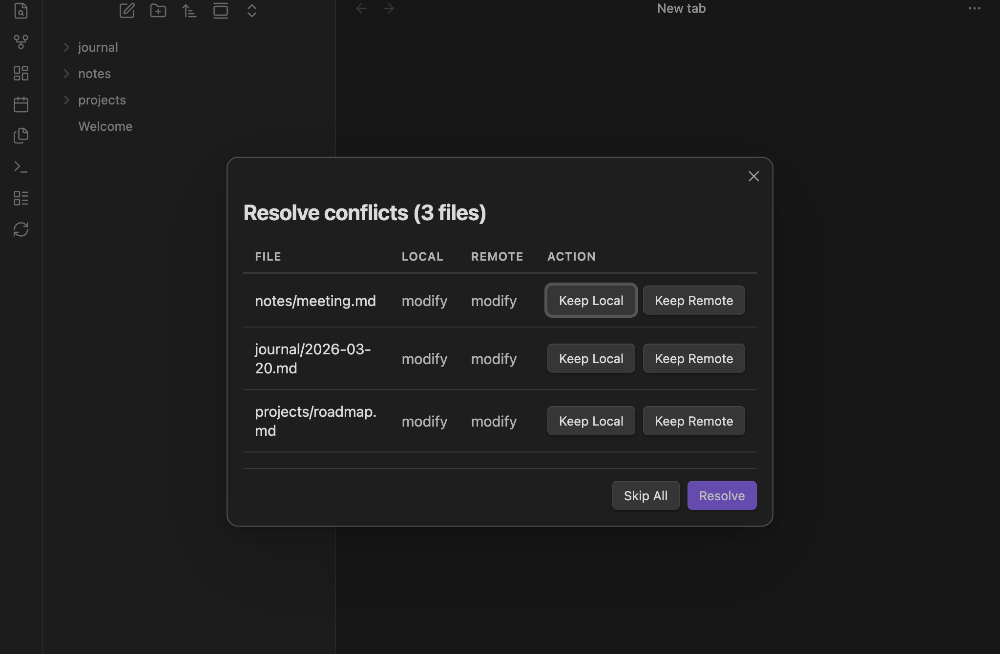
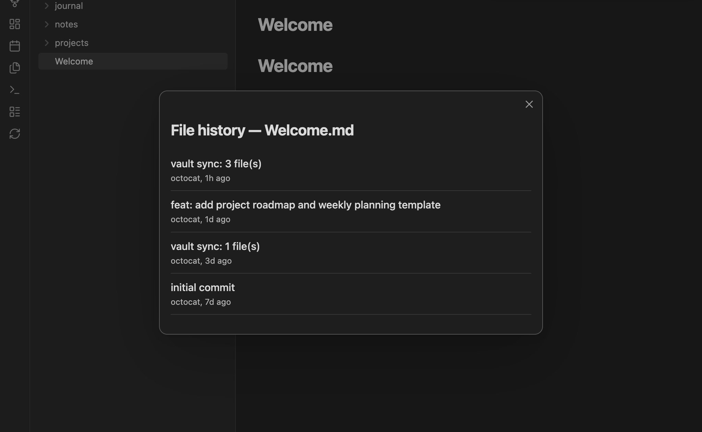

<div align="center">


# GHVault
</div>
<p align="center">
  <strong>Bidirectional vault-GitHub sync for Obsidian</strong><br>
  <i>Your vault. Your repo. Always in sync.</i>
</p>
<p align="center">
  
  
  <a href="https://github.com/nyxene/obsidian-ghvault/releases"></a>
  <a href="https://github.com/nyxene/obsidian-ghvault/actions/workflows/pr-checks.yml"></a>
  <a href="https://github.com/nyxene/obsidian-ghvault/actions/workflows/e2e.yml"></a>
  <a href="LICENSE"></a>
</p>

---

Syncs your vault to a GitHub repository using the REST and GraphQL APIs directly — no `git` binary, no shell commands, no desktop-only dependencies. Designed from the ground up to work everywhere Obsidian runs, including iOS and Android.

## Why GHVault?

Most Obsidian-to-GitHub solutions wrap the `git` CLI, which means they only work on desktop or require complex mobile workarounds. GHVault takes a different approach:

| | GHVault | git-based plugins |
|---|---|---|
| Mobile (iOS/Android) | Full support | Limited or none |
| Git CLI required | No | Yes |
| Commit signing | Automatic (GPG via GitHub) | Manual setup |
| Setup complexity | Token + repo name | Git install + SSH keys + config |
| Conflict handling | Per-file resolution (skip, local/remote wins, or interactive) | Merge conflicts (manual resolution) |

If you want simple, reliable vault backup to GitHub that works the same on every device — GHVault is for you.

## Features

- **Push & Pull** — sync changes in both directions between your vault and a GitHub repo
- **Auto-sync** — automatically syncs when files change in the vault, with configurable debounce (1–300 seconds)
- **Remote pull check** — periodically checks for remote changes and pulls them automatically, with adaptive backoff when idle
- **Mobile-first** — works on iOS, Android, and desktop equally
- **No git CLI** — uses GitHub REST API for reads and GraphQL `createCommitOnBranch` for writes
- **Conflict resolution** — configurable strategy for files changed on both sides: skip (default), local-wins, remote-wins, or ask (interactive modal with inline diff view and per-hunk accept/reject)
- **Rename detection** — detects file renames (delete + create with same content) in both directions, reports them in sync notices
- **File history** — view commit history for any file via "Show file history" command, with pagination
- **Automatic GPG signing** — commits made via GraphQL are signed by GitHub automatically
- **Rate limit aware** — tracks GitHub API rate limits and pauses before hitting them
- **SHA integrity checks** — verifies downloaded file content matches GitHub's reported SHA
- **Subfolder sync** — sync a specific folder in the repo instead of the entire repository
- **Selective sync** — `.obsidian/`, `.trash/`, and log files are never synced, plus custom exclude patterns (e.g. `drafts/**`, `*.tmp`) and per-file opt-out via `ghvault-sync: false` in frontmatter
- **Incremental sync** — uses GitHub Compare API for efficient change detection (only fetches delta, not full tree)
- **ETag caching** — conditional requests on polling (304 Not Modified = free, no rate limit cost)
- **Share as Gist** — share any note as a GitHub Gist (public or secret) with one click. Manage shared gists: copy URL, update content, or delete. Ribbon button + context menu + command palette.
- **Vault Backup** — create full vault snapshots as ZIP archives stored in GitHub Releases. Restore from any backup with one click, or download the ZIP manually from GitHub.
- **Sync status panel** — dedicated sidebar panel showing per-file sync status: conflicts, pending changes, untracked and synced files
- **Parallel operations** — file downloads and hash computation run with controlled concurrency
- **Crash recovery** — pending changes are persisted to disk and restored after restart

## Requirements

- Obsidian **1.5.0+** (desktop or mobile)
- A GitHub repository (public or private)
- GitHub Personal Access Token ([fine-grained](https://github.com/settings/tokens?type=beta) recommended)
- Internet connection (no offline sync)

## Installation

> [!NOTE]
> GHVault is in active development. We recommend testing on a non-critical repository first and keeping backups of important vaults.

GHVault is not yet in the Obsidian Community Plugins directory. Install manually:

1. Download the latest release from [Releases](https://github.com/nyxene/obsidian-ghvault/releases)
2. Extract `main.js`, `manifest.json`, and `styles.css` into your vault's `.obsidian/plugins/ghvault/` directory
3. Open Obsidian Settings → Community Plugins → Enable "GHVault"

## Setup

### 1. Create a GitHub Personal Access Token

Go to [GitHub Settings → Fine-grained tokens](https://github.com/settings/tokens?type=beta) and create a token with:

- **Repository access**: select the repository you want to sync with
- **Repository permissions**:
  - Contents: Read and Write
  - Metadata: Read-only
- **Account permissions** *(optional)*:
  - Gists: Read and Write — required for "Share as Gist" feature

> Fine-grained tokens are recommended over classic tokens — they limit access to specific repos and permissions.

### 2. Configure the plugin

Open Obsidian Settings → GHVault and fill in:



| Setting | Description |
|---------|-------------|
| **GitHub Token** | Your Personal Access Token |
| **Owner** | GitHub username or organization |
| **Repository** | Repository name |
| **Branch** | Branch to sync with (default: `main`) |
| **Sync Folder** | Subfolder in the repo to sync (leave empty for entire repo) |
| **Auto-sync** | Automatically sync when vault files change (default: off) |
| **Auto-sync debounce** | Seconds to wait after last change before syncing (1–300, default: 10) |
| **Remote pull interval** | Base interval in seconds to check for remote changes (30–3600, default: 300). Backs off automatically when idle. |
| **Conflict strategy** | How to handle files changed on both sides: `skip` (default), `local-wins`, `remote-wins`, or `ask` (per-file modal) |
| **Exclude patterns** | Custom glob patterns to exclude from sync, one per line (e.g. `drafts/**`, `*.tmp`) |
| **Log Level** | `info`, `debug`, `warn`, or `error` |

Use the **Test Connection** button to verify your settings before syncing.

### 3. Sync

Click the GHVault icon in the ribbon or run the **GHVault: Sync now** command from the command palette. Enable **Auto-sync** to sync automatically when you create, edit, delete, or rename files — the plugin waits for the debounce period after your last change before syncing.

The status bar shows the current state:

 

### Conflict resolution modal

When using the "Ask" strategy, a modal appears listing each conflicted file. Click on a file to expand an inline diff view with color-coded changes (red = removed, green = added) and line numbers. Choose "Keep Local" or "Keep Remote" for the entire file, or use per-hunk "Local"/"Remote" buttons to cherry-pick changes from each side:



### Share as Gist

Share any markdown note as a GitHub Gist. Access via ribbon icon, right-click context menu, or command palette:

- **Ribbon**: click the share icon (↗) in the left sidebar
- **Context menu**: right-click a `.md` file → "Share as Gist"
- **Command palette**: `Ctrl/Cmd+P` → "GHVault: Share note as Gist"

Choose public or secret visibility, add a description, and the URL is copied to your clipboard. Manage all shared gists via the list icon (☰) in the ribbon — copy URL, update content, or delete.

> Requires `Gists: Read and Write` in your PAT's **Account permissions**. If missing, you'll see a helpful message.

### Vault Backup

Create a full snapshot of your vault as a ZIP archive, stored as a GitHub Release:

- **Backup**: click the archive icon in the ribbon, or use `Ctrl/Cmd+P` → "GHVault: Backup vault"
- **Restore**: open the backup manager (history icon in ribbon, or `Ctrl/Cmd+P` → "GHVault: Manage backups"), select a backup, and click "Restore"
- **Manual restore**: download the ZIP directly from the [Releases](https://github.com/nyxene/obsidian-ghvault/releases) page on GitHub and extract into your vault

Each backup is tagged with a UTC timestamp (`backup-YYYY-MM-DD-HHmmss`) and includes all vault files except excluded paths. Maximum vault size for backup: 500MB.

### File history

View commit history for any file via the "Show file history" command:



## How it works

```
┌─────────────┐         ┌──────────────┐         ┌──────────┐
│  Obsidian   │         │   GHVault    │         │  GitHub  │
│  Vault      │◄───────►│   Plugin     │◄───────►│  API     │
│  (files)    │  read/  │   (sync      │  REST/  │  (repo)  │
│             │  write  │   engine)    │  GQL    │          │
└─────────────┘         └──────────────┘         └──────────┘
```

### Sync cycle

1. **Pull**: fetch the latest commit and tree from GitHub, compare with local cache, download changed files
2. **Conflict check**: detect files changed on both sides — resolve based on chosen strategy
3. **Push**: collect local changes, batch them into a single GraphQL commit

On **first sync** with a non-empty vault and repo, GHVault compares content hashes for files that exist on both sides. Identical files are cached without transfer. Files with different content are treated as conflicts.

### API usage

| Operation | API | Why |
|-----------|-----|-----|
| Read files, trees, refs | REST API | Granular access, works with large repos |
| Create commits | GraphQL `createCommitOnBranch` | Batch multiple file changes in one commit, auto GPG sign |
| First sync | Trees API + ZIP download (or batch Contents API) | ZIP for full-repo (>5 files, <100MB), per-file for subfolders |

### What gets synced

Everything in your vault **except**:

- `.obsidian/` — Obsidian configuration (device-specific)
- `.trash/` — Obsidian trash
- `ghvault.log` — plugin log file
- Files > 50MB — GitHub API hard limit

### Conflict handling

When the same file is changed both locally and on GitHub between syncs, GHVault resolves the conflict based on the configured strategy:

| Strategy | Behavior |
|----------|----------|
| **Skip** (default) | Skip the file on both sides — neither version is overwritten |
| **Local wins** | Push the local version to GitHub, overwriting the remote |
| **Remote wins** | Pull the remote version to the vault, overwriting the local |
| **Ask** | Show a modal with inline diff view — choose "Keep Local" / "Keep Remote" per file, or cherry-pick per hunk |

The number of conflicts (or resolved files) is shown in the sync Notice.

## Limitations

- **No offline sync** — requires an internet connection. Changes are queued locally but not synced until online.
- **File size limits** — files over 50MB are skipped (GitHub API limit). Files over 1.5MB are pushed via REST Git Data API (slower but reliable, up to 50MB).
- **No line-level merge** — conflicts are resolved per file or per hunk (chunk of changed lines), not by merging individual lines within a hunk.
- **API rate limits** — GitHub allows 5,000 REST requests/hour and 5,000 GraphQL points/hour. Large vaults with thousands of files may hit limits during initial sync.
- **Single branch** — syncs with one branch at a time. No multi-branch workflows.
- **No real-time sync** — remote changes are detected via periodic polling (not webhooks/websockets). The default check interval is 5 minutes, with adaptive backoff when idle.

## Security

- **Token storage**: your GitHub PAT is stored in Obsidian's `data.json` (plaintext). This is an Obsidian platform limitation — no secure keychain API is available. We recommend using fine-grained tokens with minimal scopes.
- **Token redaction**: tokens are never displayed in the UI or written to logs. Error messages are sanitized before display.
- **Path traversal protection**: all file paths from GitHub are validated against directory traversal attacks before any read/write operation.
- **SHA integrity**: downloaded file content is verified against GitHub's reported SHA to detect tampering or corruption.
- **Request timeouts**: all HTTP requests have a 30-second timeout to prevent indefinite hangs.
- **OWASP audited**: the codebase has been audited against the OWASP Top 10.

## Getting help

- **Questions?** Start a [Discussion](https://github.com/nyxene/obsidian-ghvault/discussions)
- **Found a bug?** Open an [Issue](https://github.com/nyxene/obsidian-ghvault/issues)
- **Feature idea?** Post in [Discussions → Ideas](https://github.com/nyxene/obsidian-ghvault/discussions/categories/ideas)

## Development

### Prerequisites

- Node.js 20+
- npm

### Setup

```bash
git clone https://github.com/nyxene/obsidian-ghvault.git
cd obsidian-ghvault
npm install
```

### Commands

```bash
npm run dev           # Build in watch mode
npm run build         # Production build
npm run lint          # Lint with Biome
npm run format        # Auto-fix lint issues
npm run type-check    # TypeScript type checking
npm run test          # Run tests
npm run test:coverage # Tests with coverage report
npm run test:bench    # Run benchmarks
npm run test:e2e      # E2E tests (requires Obsidian, runs via wdio-obsidian-service)
```

### Project structure

```
src/
  main.ts                  # Plugin entry point
  settings.ts              # Settings tab
  types.ts                 # Interfaces and types
  github/
    client.ts              # REST API wrapper
    graphql.ts             # GraphQL mutations
    rate-limit.ts          # Rate limit tracking
    request-timeout.ts     # Request timeout wrapper
  sync/
    engine.ts              # Sync orchestrator
    pull.ts                # Pull engine (remote → local)
    push.ts                # Push engine (local → remote)
    comparator.ts          # Local/remote diff computation
    change-queue.ts        # Debounced event queue for auto-sync
    state.ts               # SHA cache + sync state
    vault-adapter.ts       # Obsidian Vault API adapter
  ui/
    conflict-modal.ts      # Conflict resolution modal with diff view
    diff.ts                # Line-based diff algorithm (LCS)
    file-history-modal.ts  # File commit history modal
    backup-modal.ts        # Vault backup manager modal
    gist-modal.ts          # Share as Gist creation/update modal
    gist-manager-modal.ts  # Manage shared gists modal
    sync-status-view.ts    # Sidebar panel with per-file sync status
  utils/
    base64.ts              # Base64 encode/decode
    concurrency.ts         # Controlled parallel execution
    hash.ts                # SHA-256 / Git blob SHA
    logger.ts              # Structured JSON logger
    path.ts                # Path mapping and validation
```

## Built with AI assistance

This project was developed with the assistance of [Claude Code](https://claude.ai/claude-code) (Anthropic). All architecture decisions, code review, and quality control were performed by the project maintainer. AI was used as a development tool for implementation, testing, and documentation. See our [AI Policy](AI_POLICY.md) for contribution guidelines.

## License

[MIT](LICENSE)
