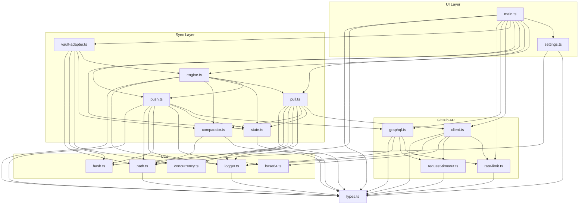

# 087 — Manual QA, dependency graph, and release checklists

**Issue:** #87
**Branch:** `docs/87-manual-qa-checklist`
**Scope:** infra

---

## Goal

Create public QA documentation in `docs/qa/`: manual test catalog with priorities, module dependency graph, release checklists (base + per-version-type), QA guide for contributors, and Obsidian community plugin compliance checks.

---

## Research Summary

Based on best practices from mature open-source projects (Zebra, VSCode extensions, Tauri) and Obsidian-specific requirements:

1. **Three-tier test priorities**: P0 (smoke, blocks release), P1 (regression), P2 (edge cases/cosmetic)
2. **Release-type scoping**: patch = P0 only, minor = P0+P1, major = P0+P1+P2
3. **Obsidian review bot** scans code before human review — we must pre-validate
4. **GitHub issue template** for per-release QA tracking
5. **QA Guide** for contributors: how to build, sideload, test on mobile

---

## Deliverables

### 1. Manual Test Catalog (`docs/qa/manual-test-cases.md`)

Master catalog of all manual test scenarios. Each test has an ID, priority, platform, and structured format.

**Format per test case:**
```
### TC-SYNC-001: Push single file change to GitHub
**Priority:** P0 (smoke)
**Platform:** Desktop, Mobile
**Preconditions:** Authenticated, repo connected, initial sync complete
**Steps:**
1. Create or edit a markdown file in vault
2. Click ribbon icon or run "GHVault: Sync now"
3. Check GitHub repository
**Expected:** File appears/updated on GitHub, notice shows "Synced — 0 pulled, 1 pushed"
```

**Test groups and counts:**

| Group | Area | P0 | P1 | P2 | Total |
|-------|------|----|----|----|----|
| A | First Launch & Settings | 3 | 1 | — | 4 |
| B | First Sync (empty vault → repo) | 2 | 2 | — | 4 |
| C | First Sync (vault → empty repo) | 1 | 1 | — | 2 |
| D | Pull (remote → vault) | 3 | — | — | 3 |
| E | Push (vault → remote) | 3 | — | — | 3 |
| F | Bidirectional | 1 | 1 | — | 2 |
| G | Conflict Detection | 1 | 1 | — | 2 |
| H | Sync Folder | — | 3 | — | 3 |
| I | Guards & Error Handling | 2 | 2 | 1 | 5 |
| J | Large Files | — | 1 | 1 | 2 |
| K | Mobile-Specific | 2 | 2 | 1 | 5 |
| L | Plugin Lifecycle | — | 2 | — | 2 |
| M | Obsidian Compliance | 3 | — | — | 3 |
| | **Total** | **21** | **16** | **3** | **40** |

**Scope by release type:**
- **Patch** (0.x.1): P0 smoke (21 tests) + regression of specific fix
- **Minor** (0.x.0): P0 + P1 (37 tests) + new feature verification
- **Major** (x.0.0): All P0 + P1 + P2 (40 tests) + performance + all platforms

#### Group A: First Launch & Settings
- TC-SET-001 [P0]: Install plugin → defaults correct (empty settings, idle status bar)
- TC-SET-002 [P0]: Enter invalid token → Test Connection → "Failed ✗"
- TC-SET-003 [P0]: Enter valid PAT + owner + repo → Test Connection → "Connected ✓"
- TC-SET-004 [P1]: Input sanitization — special chars stripped from owner/repo/branch

#### Group B: First Sync — Empty Vault → Populated Repo
- TC-FSYNC-001 [P0]: Sync with repo containing 5+ files → all pulled
- TC-FSYNC-002 [P0]: Verify nested directories created correctly
- TC-FSYNC-003 [P1]: Verify `.obsidian/`, `.trash/`, `ghvault.log` NOT synced
- TC-FSYNC-004 [P1]: Verify excluded patterns respected

#### Group C: First Sync — Populated Vault → Empty Repo
- TC-FSYNC-005 [P0]: Local files pushed, commit visible on GitHub
- TC-FSYNC-006 [P1]: Commit is GPG-signed ("Verified" badge on GitHub)

#### Group D: Pull (Remote → Vault)
- TC-PULL-001 [P0]: Add file on GitHub (web UI) → sync → file in vault
- TC-PULL-002 [P0]: Edit file on GitHub → sync → local file updated
- TC-PULL-003 [P0]: Delete file on GitHub → sync → local file removed

#### Group E: Push (Vault → Remote)
- TC-PUSH-001 [P0]: Create file in vault → sync → on GitHub
- TC-PUSH-002 [P0]: Edit file in vault → sync → GitHub updated
- TC-PUSH-003 [P0]: Delete file in vault → sync → removed from GitHub

#### Group F: Bidirectional
- TC-BIDI-001 [P0]: Add on GitHub + add different locally → sync → both sides complete
- TC-BIDI-002 [P1]: No changes → sync → "Already up to date"

#### Group G: Conflict Detection
- TC-CONF-001 [P0]: Same file changed locally + remotely → conflict notice, local unchanged
- TC-CONF-002 [P1]: Conflict on file A + clean change on file B → only B syncs

#### Group H: Sync Folder
- TC-SFLD-001 [P1]: syncFolder = "docs" → only `docs/*` pulled, paths remapped
- TC-SFLD-002 [P1]: Local file pushed with syncFolder prefix on GitHub
- TC-SFLD-003 [P1]: Files outside syncFolder not pulled

#### Group I: Guards & Error Handling
- TC-GUARD-001 [P0]: No settings → sync → "Configure settings first"
- TC-GUARD-002 [P0]: Double-click sync → "Sync already in progress"
- TC-GUARD-003 [P1]: Sync within 5s cooldown → "Please wait before syncing again"
- TC-GUARD-004 [P1]: Disable network → sync → error notice, no token in message
- TC-GUARD-005 [P2]: Expired token → sync → meaningful error, not raw API response

#### Group J: Large Files
- TC-LARGE-001 [P1]: File ~2MB → pushed successfully (REST fallback)
- TC-LARGE-002 [P2]: File >50MB → skipped, no crash

#### Group K: Mobile-Specific
- TC-MOB-001 [P0]: Install on iOS/Android → settings tab renders
- TC-MOB-002 [P0]: Configure + sync → files pulled
- TC-MOB-003 [P1]: Create file on mobile → sync → on GitHub
- TC-MOB-004 [P1]: Background/foreground → no crash, status bar correct
- TC-MOB-005 [P2]: Low memory / slow network → graceful behavior

#### Group L: Plugin Lifecycle
- TC-LIFE-001 [P1]: Disable → re-enable → settings preserved, engine rebuilt
- TC-LIFE-002 [P1]: Delete data.json → re-enable → defaults restored

#### Group M: Obsidian Community Plugin Compliance
- TC-OBSDN-001 [P0]: No `innerHTML`/`outerHTML` in codebase
- TC-OBSDN-002 [P0]: No `fetch()` — only `requestUrl()`
- TC-OBSDN-003 [P0]: No Node.js imports (`fs`, `path`, `child_process`)

---

### 2. Dependency Graph (`docs/qa/dependency-graph.md`)

Mermaid flowchart with three layers (subgraphs):



---

### 3. Release Checklist (`docs/qa/release-checklist.md`)

**Structure: base template + version-type sections.**

```markdown
# Release Checklist

## How to use this document

1. When release-please opens a release PR, create a QA tracking issue
   from the `.github/ISSUE_TEMPLATE/release-qa.md` template
2. Determine release type: patch / minor / major
3. Run the corresponding test scope (see below)
4. Check off items as you go, note failures with issue links
5. All required items must pass before merging the release PR

## Release Types

| Type | Version | Test Scope | Required |
|------|---------|------------|----------|
| Patch | 0.x.1 | Automated gates + P0 smoke | All P0 |
| Minor | 0.x.0 | Automated gates + P0 + P1 | All P0, P1 |
| Major | x.0.0 | Automated gates + P0 + P1 + P2 + mobile | All |

---

## Base Checklist (every release)

### Automated Gates
- [ ] `npm run lint` — clean
- [ ] `npm run type-check` — clean
- [ ] `npm test` — all unit tests pass
- [ ] `npm run build` — succeeds, main.js reasonable size
- [ ] `npm run test:e2e` — all E2E tests pass

### Obsidian Compliance
- [ ] No `innerHTML` / `outerHTML` usage
- [ ] No `fetch()` — only `requestUrl()`
- [ ] No Node.js imports (`fs`, `path`, `child_process`)
- [ ] No regex lookbehind (breaks iOS WebKit)
- [ ] manifest.json: id/description don't contain "obsidian"
- [ ] Inline styles minimized (prefer styles.css)

### Release Artifacts
- [ ] manifest.json version matches release
- [ ] package.json version matches release
- [ ] CHANGELOG.md updated
- [ ] main.js built in production mode
- [ ] styles.css present
- [ ] LICENSE present

---

## Patch Release (additional)
- [ ] Specific fix verified manually
- [ ] Regression test on affected area
- [ ] P0 smoke tests pass (see manual-test-cases.md)

## Minor Release (additional)
- [ ] All P0 smoke tests pass
- [ ] All P1 regression tests pass
- [ ] New features verified manually
- [ ] Settings migration (if applicable)

## Major Release (additional)
- [ ] All P0 + P1 + P2 tests pass
- [ ] Mobile QA complete (iOS and/or Android)
- [ ] Performance: sync 100+ files, measure time
- [ ] Large file handling (2MB, 50MB+)
- [ ] Full plugin lifecycle test (install/disable/enable/uninstall)

---

## Post-Release
- [ ] GitHub Release created with main.js + manifest.json + styles.css
- [ ] Release notes reviewed for accuracy
- [ ] Test install from release download on clean vault
- [ ] Update community plugins PR (if applicable)
```

---

### 4. QA Guide (`docs/qa/qa-guide.md`)

Short guide for contributors:

```markdown
# QA Guide

## Building locally
npm install && npm run build

## Sideloading the plugin (desktop)
1. Create `.obsidian/plugins/ghvault/` in a test vault
2. Copy `main.js`, `manifest.json`, `styles.css` into it
3. Obsidian Settings → Community Plugins → Enable "GHVault"

## Sideloading on mobile
1. Build on desktop
2. Copy main.js + manifest.json + styles.css to mobile vault
   (via iCloud/Google Drive sync, or manual transfer)
3. Restart Obsidian on mobile

## Test vault setup
- Create a test GitHub repo (private recommended)
- Create a fine-grained PAT with Contents: R/W, Metadata: Read
- Use a dedicated test vault (not your real notes)

## Running tests
- Unit: npm test
- E2E: npm run test:e2e
- Manual: follow docs/qa/manual-test-cases.md

## Reporting results
- For release QA: fill the checklist in the release QA issue
- For bugs found: create a separate issue with reproduction steps
- Mark tests: ✅ PASS / ❌ FAIL (#issue) / ⏭️ SKIP (reason)
```

---

### 5. GitHub Issue Template (`.github/ISSUE_TEMPLATE/release-qa.md`)

Template for per-release QA tracking:

```markdown
---
name: Release QA
about: QA checklist for a new release
title: "QA: v{version}"
labels: infra
---

## Release QA — v{version}

**Release type:** patch / minor / major
**Tester:** @
**Date:**
**Platforms tested:** macOS / Windows / Linux / iOS / Android

### Automated Gates
- [ ] lint
- [ ] type-check
- [ ] unit tests
- [ ] build
- [ ] E2E tests

### Manual Tests (P0 — smoke)
<!-- Copy relevant P0 tests from docs/qa/manual-test-cases.md -->

### Manual Tests (P1 — regression)
<!-- For minor/major releases, copy P1 tests -->

### Manual Tests (P2 — full)
<!-- For major releases only -->

### Notes
<!-- Any observations, performance measurements, etc. -->
```

---

## Files Created

| File | Description |
|------|-------------|
| `docs/qa/manual-test-cases.md` | 40 manual test scenarios with IDs and priorities |
| `docs/qa/dependency-graph.md` | Mermaid module dependency graph |
| `docs/qa/release-checklist.md` | Base + patch/minor/major release checklists |
| `docs/qa/qa-guide.md` | How to build, sideload, test, report results |
| `.github/ISSUE_TEMPLATE/release-qa.md` | Per-release QA tracking issue template |

No changes to `src/` files.

---

## Notes

- Total manual tests: 40 (21 P0, 16 P1, 3 P2)
- Obsidian compliance checks (Group M) can be partially automated later via a lint rule
- iOS regex lookbehind check is new — need to verify our codebase
- `element.style` in settings.ts warning banner may need to move to styles.css before community submission
