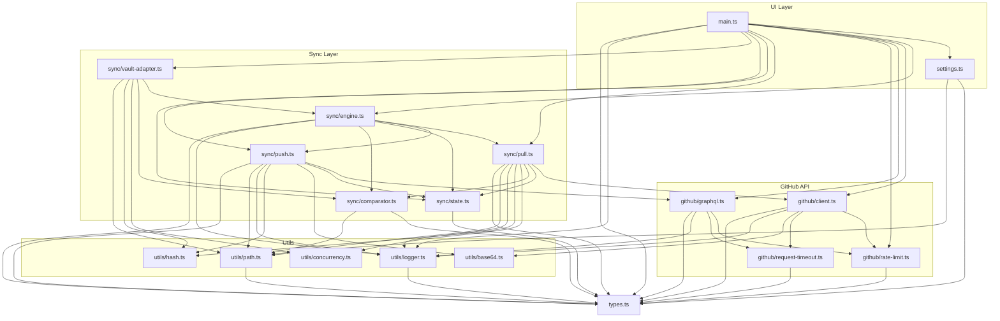

# Module Dependency Graph

Visual map of GHVault's internal module dependencies. Use this to understand blast radius of changes and plan testing scope.

## How to read

- **Arrows** show import direction: `A --> B` means A imports from B
- **Subgraphs** group modules by layer
- **Leaf nodes** (no outgoing arrows) are pure utilities — safe to refactor in isolation

## Graph

## Change Impact Matrix

When you modify a module, re-test everything that depends on it:

| Module changed | Re-test |
|----------------|---------|
| `types.ts` | Everything |
| `utils/logger.ts` | engine, pull, push, client, graphql, main |
| `utils/path.ts` | settings, pull, push, comparator, vault-adapter |
| `utils/hash.ts` | pull, push, vault-adapter |
| `utils/base64.ts` | push, client |
| `utils/concurrency.ts` | pull, vault-adapter |
| `github/rate-limit.ts` | client, graphql |
| `github/request-timeout.ts` | client, graphql |
| `github/client.ts` | pull, main |
| `github/graphql.ts` | push, main |
| `sync/state.ts` | engine, pull, push, main |
| `sync/comparator.ts` | engine, pull, vault-adapter |
| `sync/pull.ts` | engine, main |
| `sync/push.ts` | engine, main |
| `sync/vault-adapter.ts` | main |
| `sync/engine.ts` | vault-adapter, main |
| `settings.ts` | main |
| `main.ts` | E2E tests only |
